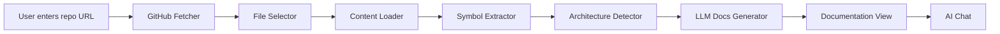

# 🚀 gitEQ - AI-Powered GitHub Repository Documentation

[](https://giteq.vercel.app/)
[](https://giteq.onrender.com)

**gitEQ** is an AI-powered tool that automatically analyzes GitHub repositories and generates comprehensive technical documentation. Simply paste a repo URL, and gitEQ will analyze the codebase structure, architecture, and generate professional documentation with an AI chatbot for interactive Q&A.


## ✨ Features

- 📁 **Repository Analysis** - Fetches and parses code structure, dependencies, and symbols
- 🏗️ **Architecture Detection** - Identifies architectural patterns (monolith, microservices, layered, etc.)
- 📄 **Auto-Generated Documentation** - Creates professional docs for Overview, Architecture, Core Modules, System Boundaries, and more
- 🤖 **AI Chat Assistant** - Ask questions about the codebase in natural language
- 📊 **Dependency Graph** - Visualizes module relationships
- ⚡ **Stress Analysis** - Identifies potential failure points and bottlenecks
- 🔑 **BYOK (Bring Your Own Key)** - Uses your Gemini API key for AI features

## 🌐 Live Demo

- **Frontend**: [https://giteq.vercel.app/](https://giteq.vercel.app/)
- **Backend API**: [https://giteq.onrender.com](https://giteq.onrender.com)

---

## 📁 Project Structure

```
gitEQ/
├── frontend/                 # React + TypeScript + Vite + TailwindCSS
│   ├── src/
│   │   ├── components/       # UI Components
│   │   │   ├── Header.tsx           # Navigation with API key input
│   │   │   ├── Sidebar.tsx          # Documentation navigation
│   │   │   ├── InitialView.tsx      # Landing page with repo input
│   │   │   ├── LoadingView.tsx      # Analysis progress animation
│   │   │   ├── DocumentationView.tsx # Rendered documentation
│   │   │   ├── ChatBot.tsx          # AI chat interface
│   │   │   └── MarkdownRenderer.tsx # Markdown to HTML renderer
│   │   ├── utils/
│   │   │   ├── api.ts        # Backend API client
│   │   │   └── storage.ts    # LocalStorage utilities
│   │   ├── types.ts          # TypeScript interfaces
│   │   ├── App.tsx           # Main application
│   │   └── index.css         # Global styles
│   ├── package.json
│   └── tailwind.config.js
│
├── backend/                  # Python + FastAPI
│   ├── main.py               # FastAPI application & API endpoints
│   ├── requirements.txt      # Python dependencies
│   ├── app/
│   │   ├── analysis/         # Code analysis utilities
│   │   │   ├── architecture_detector.py  # Detects repo architecture type
│   │   │   ├── file_selector.py          # Smart file filtering
│   │   │   └── symbol_extractor.py       # Extracts code symbols
│   │   ├── ingestion/        # GitHub data fetching
│   │   │   ├── github_fetcher.py   # Fetch repo tree & contents
│   │   │   └── content_loader.py   # Load file contents
│   │   ├── graphs/           # LangGraph pipeline
│   │   │   ├── ingestion_graph.py  # Analysis workflow graph
│   │   │   └── ingestion_nodes.py  # Individual graph nodes
│   │   ├── llm/              # LLM integrations
│   │   │   ├── gemini_client.py    # Google Gemini client
│   │   │   ├── docs/
│   │   │   │   └── docs_generator.py  # Documentation generation
│   │   │   └── chat/
│   │   │       └── chat_engine.py     # Chat Q&A engine
│   │   ├── stress/           # Stress analysis
│   │   │   ├── stress_analyzer.py    # Analyzes failure points
│   │   │   └── stress_models.py      # Data models
│   │   └── models/
│   │       └── state.py      # Pydantic state models
│   └── venv/                 # Python virtual environment
│
└── README.md
```

---

## 🛠️ Tech Stack

### Frontend
| Technology | Purpose |
|------------|---------|
| **React 18** | UI framework |
| **TypeScript** | Type safety |
| **Vite** | Build tool & dev server |
| **TailwindCSS** | Styling |
| **Lucide React** | Icons |

### Backend
| Technology | Purpose |
|------------|---------|
| **FastAPI** | REST API framework |
| **LangGraph** | Analysis pipeline orchestration |
| **Google Gemini** | LLM for docs & chat |
| **Tree-sitter** | Code parsing & symbol extraction |
| **HTTPX/AIOHTTP** | Async HTTP client |
| **Pydantic** | Data validation |

---

## 🚀 Getting Started

### Prerequisites
- Node.js 18+
- Python 3.10+
- [Gemini API Key](https://ai.google.dev/) (free)
- [GitHub Token](https://github.com/settings/tokens) (for fetching repos)

### Backend Setup

```bash
cd backend

# Create virtual environment
python -m venv venv
source venv/bin/activate  # Linux/Mac
# venv\Scripts\activate   # Windows

# Install dependencies
pip install -r requirements.txt

# Create .env file
echo 'GITHUB_TOKEN="your_github_token"' > .env
echo 'GEMINI_API_KEY="your_gemini_key"' >> .env

# Run the server
uvicorn main:app --reload --port 8000
```

### Frontend Setup

```bash
cd frontend

# Install dependencies
npm install

# Run development server
npm run dev
```

Open [http://localhost:5173](http://localhost:5173) in your browser.

---

## 📡 API Endpoints

| Endpoint | Method | Description |
|----------|--------|-------------|
| `/api/analyze` | POST | Start repository analysis |
| `/api/analysis/{id}` | GET | Get analysis status & results |
| `/api/chat` | POST | Send chat message |
| `/api/graph/{id}` | GET | Get dependency graph |
| `/docs` | GET | Swagger API documentation |

### Example: Start Analysis

```bash
curl -X POST https://giteq.onrender.com/api/analyze \
  -H "Content-Type: application/json" \
  -d '{"repo_url": "https://github.com/user/repo", "api_key": "your_gemini_key"}'
```

---

## 🔄 How It Works



1. **GitHub Fetcher** - Retrieves repository tree structure
2. **File Selector** - Filters relevant code files (ignores tests, configs, etc.)
3. **Content Loader** - Fetches actual file contents
4. **Symbol Extractor** - Parses code to extract functions, classes, imports
5. **Architecture Detector** - Identifies the overall architecture pattern
6. **LLM Docs Generator** - Uses Gemini to generate documentation sections
7. **AI Chat** - Answers questions about the analyzed codebase

---

## 🔧 Configuration

### Environment Variables

**Backend (`.env`)**
```
GITHUB_TOKEN=ghp_xxxxxxxxxxxx
GEMINI_API_KEY=AIzaxxxxxxxxxxxxxxxx
```

**Frontend** - No env needed! API URL is auto-detected.

---

## 📦 Deployment

### Frontend (Vercel)
1. Push code to GitHub
2. Import project in Vercel
3. Deploy automatically

### Backend (Render)
1. Push code to GitHub
2. Create new Web Service in Render
3. Set build command: `pip install -r requirements.txt`
4. Set start command: `uvicorn main:app --host 0.0.0.0 --port $PORT`
5. Add environment variables

---

## 🤝 Contributing

1. Fork the repository
2. Create your feature branch (`git checkout -b feature/amazing-feature`)
3. Commit your changes (`git commit -m 'Add amazing feature'`)
4. Push to the branch (`git push origin feature/amazing-feature`)
5. Open a Pull Request

---

## 📄 License

This project is licensed under the MIT License - see the [LICENSE](LICENSE) file for details.

---

## 🙏 Acknowledgments

- [Google Gemini](https://ai.google.dev/) for the AI capabilities
- [LangGraph](https://python.langchain.com/docs/langgraph) for pipeline orchestration
- [Tree-sitter](https://tree-sitter.github.io/) for code parsing

---

<p align="center">
  Made with ❤️ by <a href="https://github.com/SanchitKulkarni1">Sanchit Kulkarni</a>
</p>